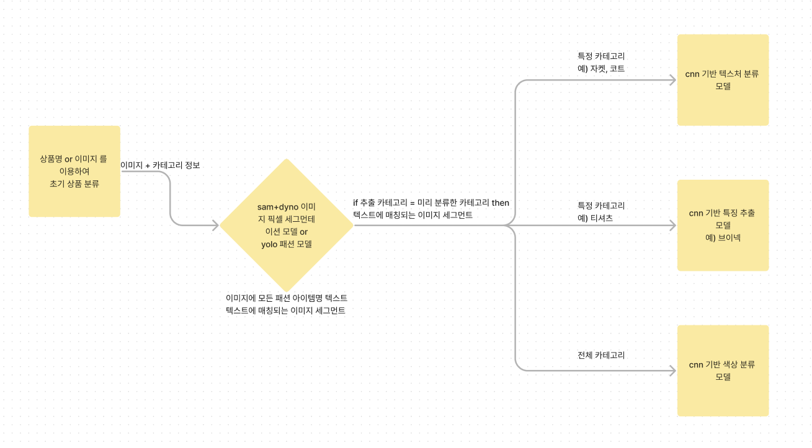

# 이미지 분류 모델

## 전체 프로세스 구상(프리트레인 모델을 파인튜닝)
    


`예시`  
1. 상품명 : 남자 면바지, 이미지명: img.jpg  
2. 상품명에서 카테고리 정보를 추출하여 이미지와 상품카테고리 정보를 매칭해둠  
3. 이미지명: img.jpg, 매칭카테고리: pants  
4. 이미지를 세그멘테이션 모델에 넣고 디텍팅된 상품카테고리 중 상품명에서 추출한 카테고리명과 동일한 카테고리의 이미지 세그먼트를 추출  
5. 이미지 속 추출한 카테고리 ‘top’와 ‘pants’ 중 매칭카테고리와 동일한 pants에 해당하는 이미지 추출
아래의 경우 바지 부분만 이미지로 추출  


6. 바지 이미지를 각각의 특징 분류 모델에 넣어 결과 추출
    

## 예상 작업 절차
- 기본 모델 학습 테스트
  - 그라운딩 샘
  - yolo
  - 프리트레인 색상 분류 cnn 계열 모델
      - 그라운딩 샘 출력 > 색상 분류 모델 입력 > 색상 분류 확인
- 학습 데이터 정리
  - 각 task에 맞게 분류 및 수집
- 초기  object detect 모델 선택 > 성능 및 용량 등 비교
  - sam 이나 yolo 외 다른 모델도 고려
- cnn 계열 모델 선택
  - 큰 1개 모델 vs 작은 3개 모델
- 초기 학습
    - 이미지넷 데이터 (라벨 1,000개, 학습데이터 10,000개, 테스트 2,500개) 알렉스넷 모델, a100 5 epoch 학습 시 3시간 정도 걸림
    - ~~분류 모델의 웨이트를 공유할 수 있도록 학습 시키는 방법도 고려 (사이즈 큰 모델 선택 시)~~

            

### 참고
- 모델
    - `sam + grounding dyno` > 파인튠 가능
        - 이미지 세그멘테이션과 라벨링이 가능한 모델이고 패션 상품도 나름 잘되는 편
        - https://github.com/IDEA-Research/Grounded-Segment-Anything
    - `yolo`패션이미지 분류 모델 > 파인튠 가능
        - 이미지 바인딩 박스와 라벨링이 가능한 패션 모델
        - https://github.com/valentinafeve/fine_tunning_YOLOS_for_fashion
        - [https://huggingface.co/valentinafeve/yolos-fashionpedia](https://huggingface.co/valentinafeve/yolos-fashionpedia)
- 이미지 데이터 셋:
    - `패션피디아` > 카테고리
    - [https://huggingface.co/datasets/detection-datasets/fashionpedia](https://huggingface.co/datasets/detection-datasets/fashionpedia)
        - 욜로 패션 모델에 사용된 데이터
    - `딥패션` > 카테고리 + 속성
    - [https://mmlab.ie.cuhk.edu.hk/projects/DeepFashion/AttributePrediction.html](https://mmlab.ie.cuhk.edu.hk/projects/DeepFashion/AttributePrediction.html)
    - 딥패션 파일 설명
        - 28만개
        - 카테고리 분류 50개
        - 속성(텍스처, 패브릭, 스타일, 쉐입, 파트) 1000개
        - bbox 정보, 1000개 원핫인코딩(-1,1), 카테고리 라벨링 데이터 포함
            - texture와 fabric, part 까지만 있어도 무방
            
            
            
        - 전체 데이터를 이미 분류한 트레인, 테스트, val 데이터 정보가 각각 나눠져 있음 > 안써도 상관 없음
            - 이미지가 각 의류별 폴더에 저장되어 있어서 이미지명은 폴더 경로를 포함함
            
            `img/Paisley_Print_Babydoll_Dress/img_00000050.jpg`
            
        - 속성 데이터가 원핫 인코딩 형태로 저장되어 있음
            - **각 색상 외의 속성은 멀티 라벨 분류 모델,한 모델로 제작 + 색상은 별도 모델**
                


## 딥패션 분류 모델 학습


속성 1000개의 데이터수가 너무 많아 넥쉐입에 해당하는 속성 데이터만 학습
 
```
['boat neck',
    'classic crew neck',
    'classic v-neck',
    'cowl neck',
    'crew neck',
    'deep v-neck',
    'fitted v-neck',
    'heathered v-neck',
    'high-neck',
    'illusion neckline',
    'knit v-neck',
    'mock neck',
    'mock-neck',
    'neck ribbed',
    'neck skater',
    'neck striped',
    'neckline',
    'print v-neck',
    'scoop-neck',
    'split-neck',
    'striped v-neck',
    'tie-neck',
    'turtle-neck',
    'v-neck']
```
        

        
```jsx
from torchvision import models
from torchinfo import summary
import torch

model = models.resnet18(weights = "ResNet18_Weights.IMAGENET1K_V1")
device = "cuda" if torch.cuda.is_available() else "cpu"
model

from torch import nn
from torch import optim
from torch.nn import functional as F

model.fc = nn.Linear(512,24)

def loss_fn(outputs, targets):
    return torch.nn.BCEWithLogitsLoss()(outputs, targets)
optimizer = optim.SGD(model.parameters(),lr = hyperparams['learning_rate'])

from transformers import get_cosine_schedule_with_warmup

scheduler = get_cosine_schedule_with_warmup(optimizer,
                                            num_warmup_steps = len(train_dataloader)*3,
                                            num_training_steps = len(train_dataloader)*hyperparams['epochs'])

for epoch in range(hyperparams['epochs']):
    cost = 0.0
    i = 0
    perc = hyperparams["batch_size"]/train_dataset.__len__() * 100
    for images, classes in train_dataloader:
    images = images.to(device)
    classes = classes.to(device)

    output = model(images)
    loss = loss_fn(output,classes)

    optimizer.zero_grad()
    loss.backward()
    optimizer.step()
    scheduler.step()

    cost += loss
    i = i + 1
    percf = perc*i
    print(f"{epoch+1} Epoch : {percf:.1f} % complete")

    cost = cost/len(train_dataloader)
    print(f"Epoch : {epoch+1:4d}, Cost : {cost:.3f}")
```
        
11000 개 정도의 데이터를 resnet18 모델 3에폭
a100 20시간 정도는 소요
분류모델은 resnet으로 진행하였으나 학습속도가 너무 늦어 vgg16으로 작업할 예정
        
```jsx
0 Epoch : 11.6 % complete
0 Epoch : 23.2 % complete
0 Epoch : 34.7 % complete
0 Epoch : 46.3 % complete
0 Epoch : 57.9 % complete
0 Epoch : 69.5 % complete
0 Epoch : 81.0 % complete
0 Epoch : 92.6 % complete
Epoch :    1, Cost : 0.743
1 Epoch : 11.6 % complete
1 Epoch : 23.2 % complete
1 Epoch : 34.7 % complete
1 Epoch : 46.3 % complete
1 Epoch : 57.9 % complete
1 Epoch : 69.5 % complete
1 Epoch : 81.0 % complete
1 Epoch : 92.6 % complete
Epoch :    2, Cost : 0.743
2 Epoch : 11.6 % complete
2 Epoch : 23.2 % complete
2 Epoch : 34.7 % complete
2 Epoch : 46.3 % complete
2 Epoch : 57.9 % complete
2 Epoch : 69.5 % complete
2 Epoch : 81.0 % complete
2 Epoch : 92.6 % complete
Epoch :    3, Cost : 0.741
```


## 최종 모델 적용

욜로 모델로 이미지에서 패션 아이템의 label과 bbox를 뽑아낸 뒤  


sam에 bbox 데이터를 인풋으로 넣어 해당 label의 mask를 추출  


마스크에 해당하는 이미지만 추출하여 분류 모델의 인풋에 넣고 결과 추출  


## 참고
- 현재 분류 모델의 충분한 학습이 진행되지 않아 정확도가 낮은편  
- 학습데이터가 인물이 포함된 이미지라서 마스크 영역의 이미지보다 전체 이미지의 정확도가 높음  
- 특정 쇼핑몰에서 모델이 다양한 자세와 장소에서 촬영한 메인 이미지를 사용하는 경우 욜로 모델이 정확한 bbox 탐지가 어려움  